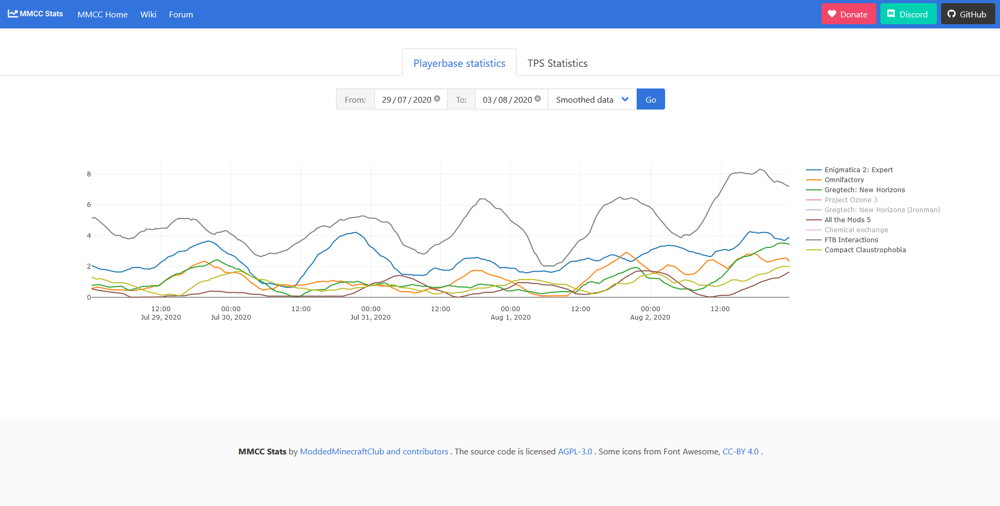

# Mmcc.Stats

   

MMCC Playerbase Statistics - available at [poller.moddedminecraft.club](https://poller.moddedminecraft.club/).

## Build Release version

**1.** Clone this repository. From now on we'll refer to the root directory of the cloned repository as `./`

**2.** Rename `./src/Mmcc.Stats/appsettings.default.json` to `./src/Mmcc.Stats/appsettings.json` and fill it in.

**3.** In the root directory of the cloned repository run the following command: `dotnet publish ./src/Mmcc.Stats -c Release --output ./out`.

**4.** You will find the compiled version of the app in `./out`.
